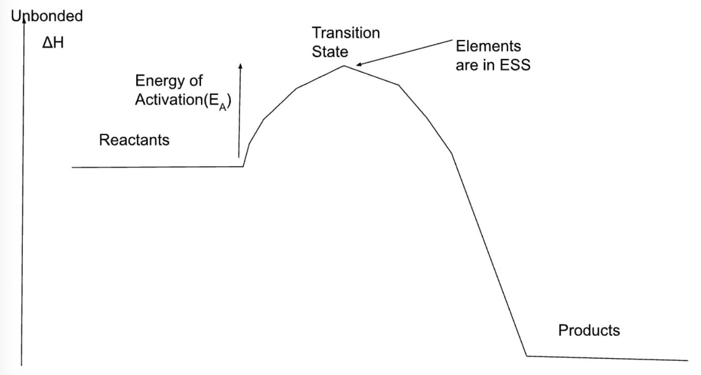
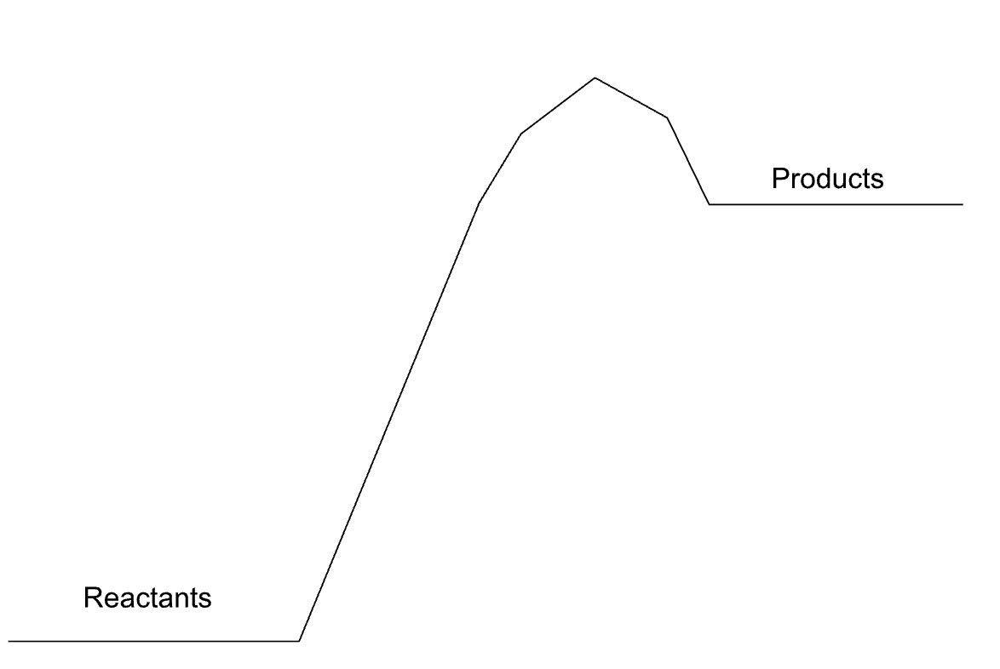

1. Classify a process as exo/endothermic from data or observations
2. Draw a reaction energy profile, including the enthalpy change ΔH, activation energy Ea, transition state, and reference or unbonded states
3. Relate enthalpy changes to changes in the relative strength of bonding in the reactants and products

## Exo/Endothermic Processes

**Exothermic Reaction:** Release heat energy into the surroundings. More energy is in the reactants than the products.

**Endothermic Reaction:** Absorb heat energy from the surroundings. More energy is in the products than the reactants.

## Temperature vs. Time

**Exothermic:**

**Endothermic:**

