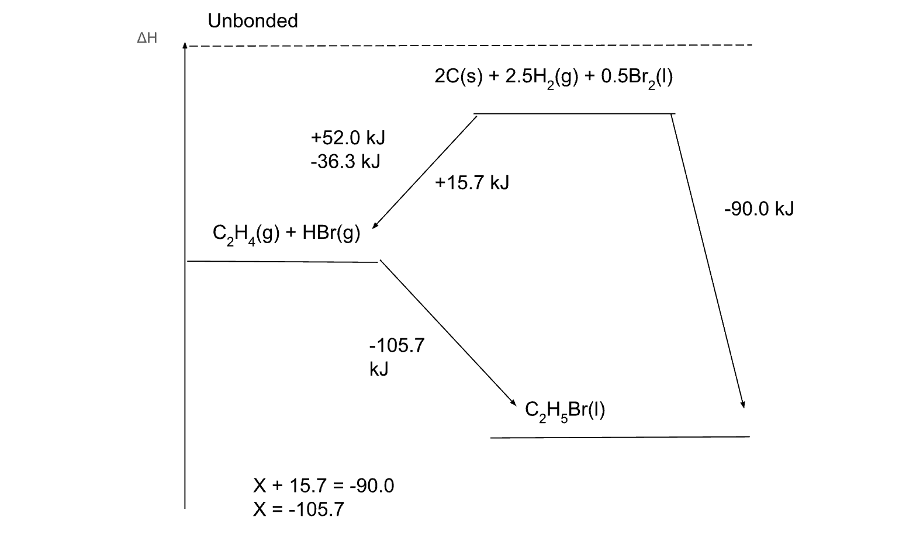

1. Define and write the equations corresponding to the enthalpy of formation, enthalpy of combustion, and enthalpy of atomization of substances
2. Construct enthalpy cycles to compare the relative strengths of bonding in different substances or calculate an enthalpy change

## Defining/Writing Enthalpy Equations

**Definitions:**
- Enthalpy of atomization ($$ \delta H_a$$): The enthalpy change when one mole of gaseous atoms is formed from the element in its standard state.
- Enthalpy of combustion ($$ \delta H_c$$): The enthalpy change when one mole of a substance is burned completely in oxygen to form $$CO_2$$ and $$H_2O$$.
- Enthalpy of formation ($$ \delta H_f$$): The enthalpy change when one mole of a compound is formed from its elements in their standard states.
- Enthalpy of solution ($$ \delta H_s$$): The enthalpy change when one mole of a substance is dissolved in a large volume of solvent.

## Hess's Law

**Hess's Law:**  Hess’s Law states that the energy required to transform the reactants into ESS and then into products is equal to the energy required to turn the reactants into the products.

ΔHf, go both ways, meaning that it requires the same amount of energy to separate them into their ESS as their enthalpy of formation.

**Provided:**
- An equation
- ΔH of formation for each compound
- Elements in standard states (ESS)

**Solving Hess's Law Problems:**
Determine the enthalpy of reaction of:
$$C_{2}H_{4} (g) + HBR (g) => C_{2}H_{5}Br (l)$$

| $$ \delta H_{f} | kJ/mol|
|--|--|
| $$C_{2}H_{4} (g) | +52.0 |
| $$HBr (g) | -36.3|
| $$C_{2}H_{5}Br (l) | -90.0|

We can draw a quick diagram:

:::note

The word problem might provide some values for the Hess’s Law diagram, such as an enthalpy of combustion. Note that in cases of combustion, remember the reactants and products ($$O_2$$, and $$CO_2 + H_2O$$ respectively)
:::

:::caution
Remember to balance an equation. If there are multiple of a reaction or product, and the enthalpy value is for a single unit, multiply that value by the number of units.
:::

