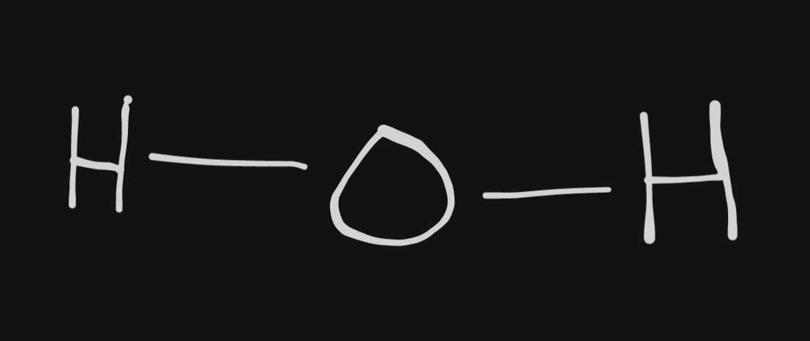
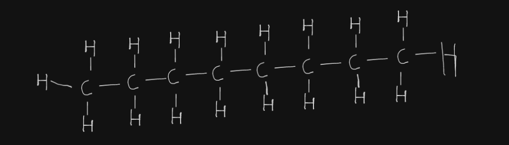
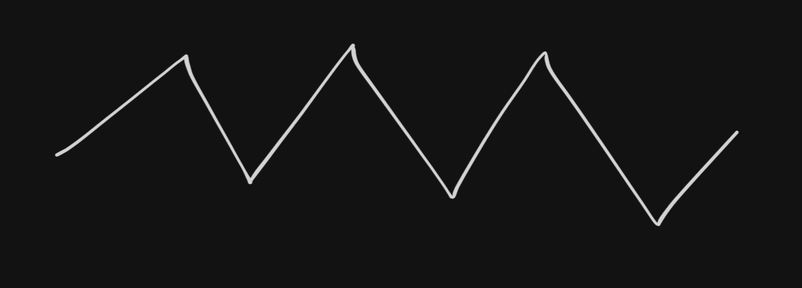

1. Convert between structural, line, and skeletal formulas.
2. Predict possible structural isomers associated with a molecular formula.

## Converting Between Formulas

### Structural Formula

Classic letters & lines. Doesn't show true shape, only bonds between atoms.

**Formulae for water:**

Molecular: $\text{H}_2\text{O}$

Structural:

**Formulae for octane:**

Structural:

Molecular: $\text{C}_8\text{H}_{18}$ (octane)

### Line Formula

**Does not involve lines**. Basically a molecular formula, but gives more
information about the structure.

**Formulae for octane:**

Line: $CH_3\left(CH_2\right)_6CH_3$
Molecular: $\text{C}_8\text{H}_{18}$

### Skeletal Formula

Used specifically for organic chemistry; removes the clutter of $\text{C}$s and
$\text{H}$s.

**Formulae for octane:**

Skeletal:

Molecular: $\text{C}_8\text{H}_{18}$

## Isomers

Isomers are molecules with the same molecular formula, but different
structures. There are two categories of isomers:

### Structural Isomers

A structural isomer has the same number of atoms of each element (thus the same
molecular formula), but the atoms are *connected* in different ways.

### Stereoisomers

A stereoisomer has the same atoms connected in the same way, but in a different
shape.

## Identifying the (Structural) Isomers of a Molecular Formula
