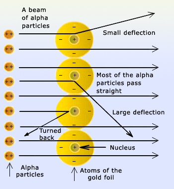

    
1. Describe and explain the evidence that led to Rutherford's nuclear model of the atom, as well as the discovery of protons and neutrons.

## Rutherford's Gold Foil Experiment

1. Alpha particles are emitted from poponium at gold foil, that is only a few atoms thick.
2. The foil is coated with zinc sulfide, which emits a flash of light when struck by an alpha particle.
3. Most alpha particles pass through the foil, but some are deflected at large angles.

## Experimental Results & Model
- Rutherford thought an atom was mostly empty space and it contained a small & dense nucleus.
- Positively charged nucleus contained most of the mass, while electrons orbitted.
- Particles that got too close to the nucleus were deflected.

***Several questions also arose from this experiment:***

 

 <strong>What holds the nucleus together?</strong> 

> Chemists invent some arbitrary force noboyd can explain called strong nuclear force holds the nucleus together.

 

 <strong>Why don't electrons fall into the nucleus?</strong> 

> See Unit 10 :)

-------------------
#### Rutherford Gold Foil Diagram

### Mosley's Law

Mosley shoots a bunch of elements with cathode rays, causing an emission of X-rays. He found that graphing the square root of X-ray frequency to some very specific integer *N* would make a linear relationship on the graph.

- This integer *N* is the atomic number of the element.
- This law helped to reorganize the periodic table by atomic number, not atomic mass.
- Elements in solid samples were able to be identified by their X-ray frequencies.
- Helped discover elements 43, 61, 72, 75, 85, and 87.
