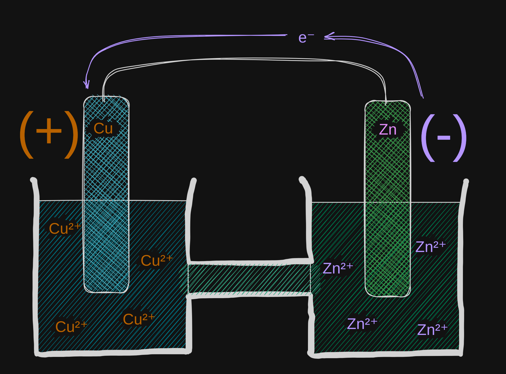

1. Explain and show using appropriate diagrams how a voltaic cell functions and
   predict the effect of changes on cell voltage and other properties.

Voltaic cells consist of two metal electrodes in an aqueous solution containing
their own ions and connected by a salt bridge, and the electrodes connected by
a wire. A current is produced across the wire as a redox reaction occurs.

Here, there'd be the `half reactions`:

$\text{Cu}^{2+}_{(aq)} + 2e^- \to \text{Cu}_{(s)}$

$\text{Zn}_{(s)} \to \text{Zn}^{2+}_{(aq)} + 2e^-$

And the net reaction:

$\text{Zn}_{(s)} + \text{Cu}^{2+}_{(aq)} \to \text{Zn}^{2+}_{(aq)} + \text{Cu}_{(s)}$
