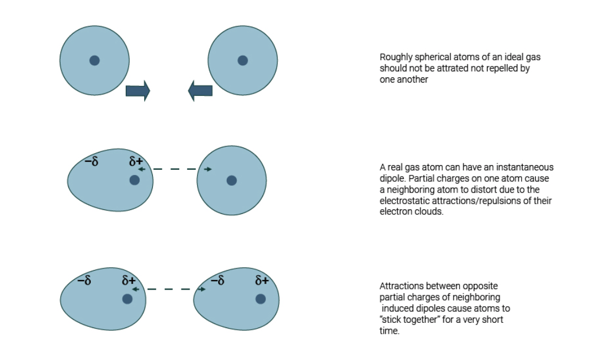

1. Describe the origin of London Dispersion Forces

## What The Hell Even IS IMF?

**Intermolecular Force (IMF):** When two particles experience IMF, a positive charge on one particle is attracted to a negative charge on another. 

## LDF

- LDFs exist for all substances, and arise from some temporary polarities across an atom, when electrons "slosh" around
- An instantaneous polarity in one molecule may induce an opposing polarity in an
adjacent molecule.
- Molecules with higher molecular weights have larger numbers of electrons, and therefore are more deformable by nearby charges. 
- Molecules with more electrons have higher LDFs, and thereby higher melting points, boiling points, and enthalpy of vaporizations.

