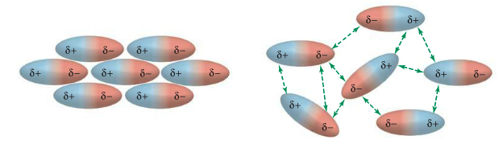

(1) Explain how electronegativity is defined and make predictions about polarity, BDEs, and periodic trends in electronegativity.

## Dipole Forces

- Dipole-dipole forces exist between molecules that are polar: those that have a permanent dipole moment due to uneven sharing of electrons.
- Uneven sharing gives one side of the molecule a partial positive charge (δ+) and the other side a partially negative charge (δ-)
- In general, dipole-dipole is stronger than LDF, and therefore, would have higher boiling or melting points than particles binded with LDF.

## Electronegativity

**Electronegativity:** Electronegativity is a measure of the tendency of an atom to attract a bonding pair of electrons.

Down a period, electronegativity usually increases, while down a group, it decreases. These trends depend on:
The attraction that a bonding pair of electrons feels for a particular nucleus depends on:
- the number of protons in the nucleus;
- the distance from the nucleus;
- the amount of screening by inner electrons.

More generally, just use a periodic table that contains each of the electronegativities of the elements to figure out the electronegativity of an element.

## Dipole Moment
We can compute the dipole moment by comparing all the electronegativities of the atoms with the core atom, and seeing about what direction of the resulting vector is. A larger dipole moment generally means the molecule is more polarized, and has larger BP or MP.

